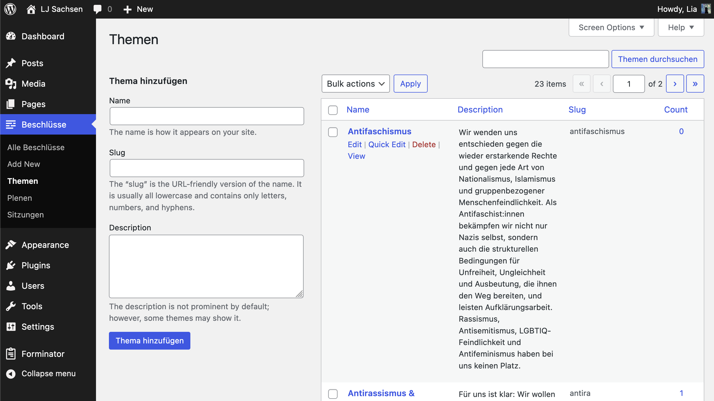

# LJS Tools

Dieses Plugin gibt deiner LJ WordPress Seite neben dem [Style](https://github.com/matebitte/ljs-mode) auch sägssi swag: es fügt einen Post typ für Beschlüsse hinzu, tackert deine Tags als Themen dran und ermöglicht es dir sie in LJP Tagungen sowie BR Sitzungen einzusortieren.

## Known Bugs
- kommentare sollten deaktiviert sein, sind es aber nicht

## Roadmap
- custom LJS Admin Color Scheme
- konfigurierbare Labels
